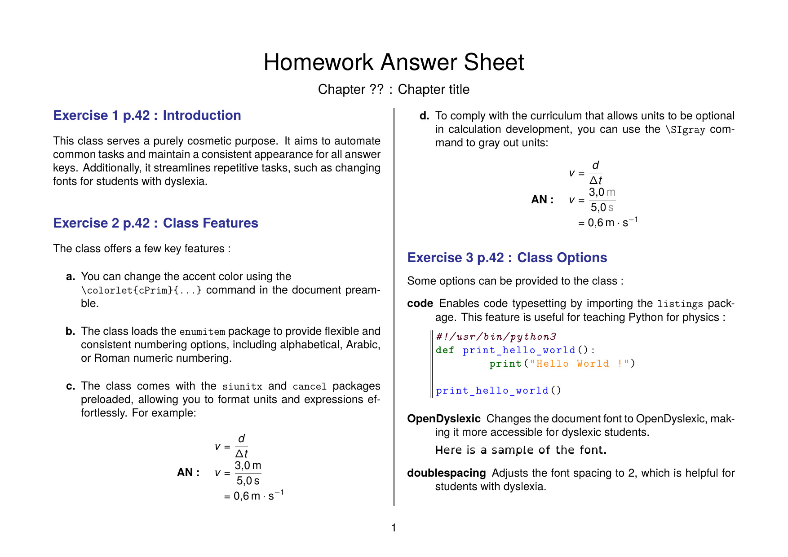

# High School Physics LaTeX classes

These LaTeX classes were developed at the beginning of my teaching career to simplify the creation of high school physics course materials. They address several key needs:

- **Standardization of Documents:** By structuring documents with consistent sections for various types of activities (e.g., labs, exams, course notes), I saved time in designing materials.
- **Automation of Repetitive Tasks, Especially for Exams:** I quickly realized that creating both an exam and its answer key, testing both, and making simultaneous updates was prone to *very* frequent errors. These classes help automate these processes.

## Preview

<table>
<tr>
    <th> HSP-Experiment </th>
    <th> HSP-AnswerSheet </th>
    <th> HSP-Lecture </th>
    <th> HSP-Test </th>
</tr>
<tr>
    <td>  </td>
    <td>   </td>
    <td>  </td>
    <td>  </td>
</tr>
<tr>
    <td> </td>
    <td> </td>
    <td> </td>
    <td>  </td>
</table>

## Installation

1. Download the `.cls` file corresponding to your desired class from this repository.
2. Place the `.cls` file in the same directory as your `.tex` document.
3. In your LaTeX document, use the following command to select the desired class:
   ```latex
   \documentclass{HSP-[class_name]}
   ```

## Usage

Detailed instructions and examples for using these LaTeX classes are provided in the respective subfolders within this repository.

For examples of files produced with those classes, you can refer to the images in the `res/png` directory.

## License

This project is licensed under the [MIT License](https://choosealicense.com/licenses/mit/). You are free to use, modify, and distribute this software as long as you include the original license.
